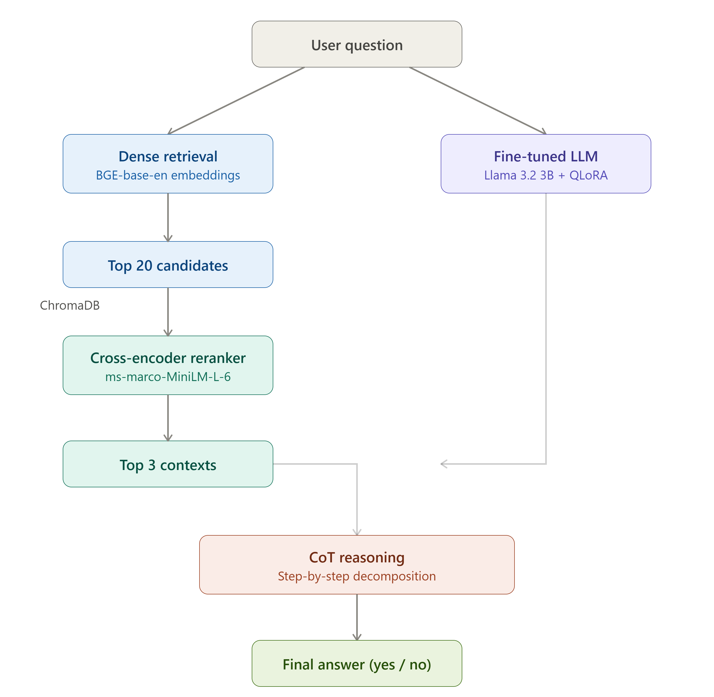

# RAG + QLoRA Fine-tuning for Multi-hop Question Answering

A complete pipeline for fine-tuning Llama 3.2 3B using QLoRA and building a 
Retrieval-Augmented Generation (RAG) system with cross-encoder reranking, 
evaluated on the StrategyQA multi-hop reasoning benchmark.

## Results

| Configuration | Accuracy | Macro F1 |
|---|---|---|
| Base LLM (no RAG) | 58.7% | 0.526 |
| Base LLM + RAG + Reranker | 58.7% | 0.507 |
| **Fine-tuned + RAG + Reranker** | **62.9%** | **0.609** |

Fine-tuning with Chain-of-Thought supervision improves Macro F1 by **15.7%** 
over the base model baseline.

## Architecture



## Key Findings

- **Fine-tuning consistently outperforms base model** across open-domain multi-hop reasoning (StrategyQA)
- **RAG alone does not improve base model performance** — retrieval only helps 
  when combined with fine-tuning
- **Cross-encoder reranking improves retrieval quality** from 10/50 to 13/50 
  relevant passages retrieved
- **Reasoning failures (22%) exceed retrieval failures (14%)** — suggesting 
  future work should focus on stronger reasoning supervision rather than 
  retrieval engineering
- **Chain-of-Thought fine-tuning** teaches the model to decompose questions 
  into reasoning steps before answering, improving prediction calibration

## Tech Stack

- **Fine-tuning**: QLoRA (4-bit quantization, LoRA rank=16) via PEFT + TRL
- **Base Model**: Llama 3.2 3B Instruct
- **Embeddings**: BAAI/bge-base-en-v1.5
- **Vector DB**: ChromaDB
- **Reranker**: cross-encoder/ms-marco-MiniLM-L-6-v2
- **Hardware**: NVIDIA RTX 3050 4GB VRAM

## Setup

```bash
# 1. Install PyTorch with CUDA 12.1
pip install torch==2.5.1+cu121 --index-url https://download.pytorch.org/whl/cu121

# 2. Install dependencies
pip install -r requirements.txt

# 3. Login to HuggingFace (required for Llama access)
huggingface-cli login
```

## Usage

### Step 1 — Fine-tune the model
```bash
python train.py
```

### Step 2 — Build knowledge base
```bash
python build_kb.py
```

### Step 3 — Run evaluation
```bash
python config1.py   # Base LLM only
python config2.py   # Base LLM + RAG
python config3.py   # Fine-tuned + RAG
python compare_results.py  # Print comparison table
```

## Fine-tuned Models

| Model | Dataset | HuggingFace |
|---|---|---|
| Llama 3.2 3B + QLoRA | StrategyQA | [AlsoMeParth/strategyqa-llama3.2-3b-qlora](https://huggingface.co/AlsoMeParth/strategyqa-llama3.2-3b-qlora) |
| Llama 3.2 3B + QLoRA | PubMedQA | [AlsoMeParth/pubmedqa-llama3.2-3b-qlora](https://huggingface.co/AlsoMeParth/pubmedqa-llama3.2-3b-qlora) |

## Training Details

| Parameter | Value |
|---|---|
| Base Model | Llama 3.2 3B Instruct |
| Quantization | 4-bit NF4 |
| LoRA Rank | 16 |
| LoRA Alpha | 32 |
| Learning Rate | 2e-4 |
| Epochs | 2 |
| Batch Size | 2 |
| Max Sequence Length | 300 |
| Hardware | RTX 3050 4GB |
| Training Time | ~1 hour |